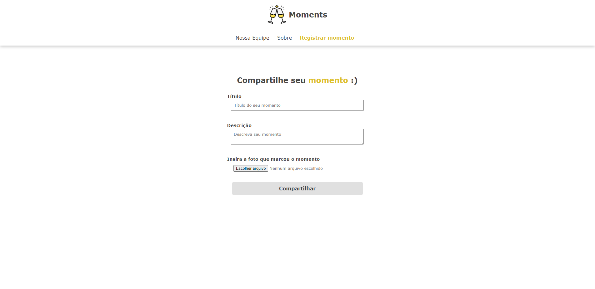

# Moments
Moments é uma plataforma capaz de salvar momentos com título, descrição e imagens. Além disso, é possível deixar comentários em cada momento. Além disso a plataforma conta com algumas páginas principais para navegação do usuário. [propósito educacional]

## Version
This project was generated with [Angular CLI](https://github.com/angular/angular-cli) version 15.2.4.

## Development server
Run `node ace serve`. Navigate to `http://localhost:3333/`. É necessário o projeto Adonis disponível em: https://github.com/joaoabjr/adonis-backend-moments. 

